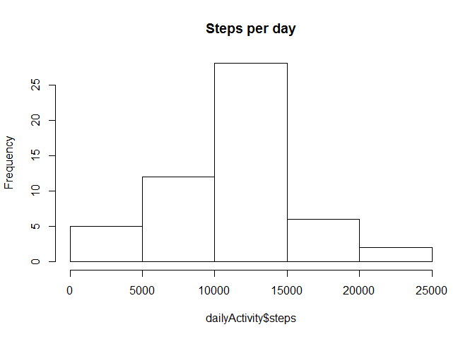
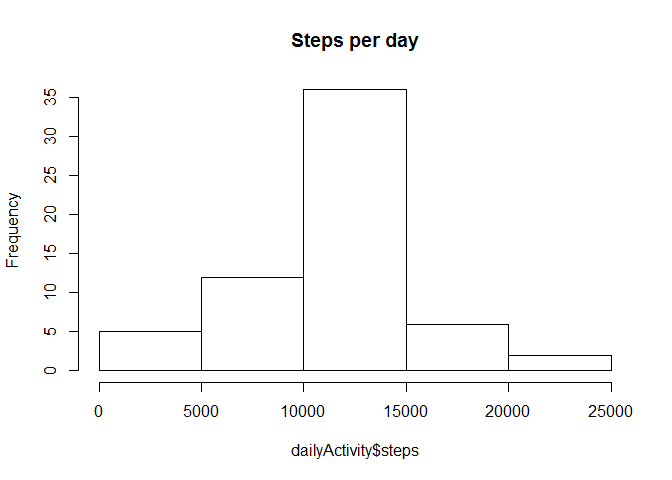

# Reproducible Research: Peer Assessment 1


## Loading and preprocessing the data

```r
#1. Load the data (i.e. `read.csv()`)
setwd("C:/Temp/Coursera/ReproducibleResearch/PeerAssessment1/RepData_PeerAssessment1")
unzip("activity.zip")
activity <- read.csv("activity.csv")

#2. Process/transform the data (if necessary) into a format suitable for your analysis
activity$date <- as.Date(as.character(activity$date), format="%Y-%m-%d")
```


## What is mean total number of steps taken per day?

```r
# 1. Make a histogram of the total number of steps taken each day
library(dplyr)
```

```
## Warning: package 'dplyr' was built under R version 3.1.3
```

```
## 
## Attaching package: 'dplyr'
## 
## The following object is masked from 'package:stats':
## 
##     filter
## 
## The following objects are masked from 'package:base':
## 
##     intersect, setdiff, setequal, union
```

```r
dailyActivity <- summarize(group_by(activity,date), steps = sum(steps))
hist(dailyActivity$steps, main="Steps per day")
```

 

```r
# 2. Calculate and report the **mean** and **median** total number of steps taken per day
summary(dailyActivity)
```

```
##       date                steps      
##  Min.   :2012-10-01   Min.   :   41  
##  1st Qu.:2012-10-16   1st Qu.: 8841  
##  Median :2012-10-31   Median :10765  
##  Mean   :2012-10-31   Mean   :10766  
##  3rd Qu.:2012-11-15   3rd Qu.:13294  
##  Max.   :2012-11-30   Max.   :21194  
##                       NA's   :8
```


## What is the average daily activity pattern?

```r
# 1. Make a time series plot (i.e. `type = "l"`) of the 5-minute interval (x-axis) and the average number of steps taken, averaged across all days (y-axis)
completeRows <- na.omit(activity)
intvlActivity <- summarize(group_by(completeRows,interval), steps = mean(steps))
with(intvlActivity, plot(interval, steps, type="l"))
```

 

```r
#2. Which 5-minute interval, on average across all the days in the dataset, contains the max number of steps?
# Answer: interval 835
summary(intvlActivity)
```

```
##     interval          steps        
##  Min.   :   0.0   Min.   :  0.000  
##  1st Qu.: 588.8   1st Qu.:  2.486  
##  Median :1177.5   Median : 34.113  
##  Mean   :1177.5   Mean   : 37.383  
##  3rd Qu.:1766.2   3rd Qu.: 52.835  
##  Max.   :2355.0   Max.   :206.170
```

```r
filter(intvlActivity,steps>=206.1)
```

```
## Source: local data frame [1 x 2]
## 
##   interval    steps
## 1      835 206.1698
```


## Imputing missing values

```r
# 1. Calculate and report the total number of missing values in the dataset (i.e. the total number of rows with `NA`s)
sum(!complete.cases(activity))
```

```
## [1] 2304
```

```r
# 2. Devise a strategy for filling in all of the missing values in the dataset. The strategy does not need to be sophisticated. 
# Strategy: replace missing values with average of all non-missing values.

#3. Create a new dataset that is equal to the original dataset but with the missing data filled in.
withImputed <- activity   
withImputed$steps[is.na(withImputed$steps)] <- mean(activity$steps, na.rm=TRUE)

#4. Make a histogram of the total number of steps taken each day and Calculate and report the **mean** and **median** total number of steps taken per day. Do these values differ from the estimates from the first part of the assignment? What is the impact of imputing missing data on the estimates of the total daily number of steps?
#   Answer: It raised the first quartile, median, and third quartile.
dailyActivity <- summarize(group_by(withImputed,date), steps = sum(steps))
hist(dailyActivity$steps, main="Steps per day")
```

 

```r
summary(dailyActivity)
```

```
##       date                steps      
##  Min.   :2012-10-01   Min.   :   41  
##  1st Qu.:2012-10-16   1st Qu.: 9819  
##  Median :2012-10-31   Median :10766  
##  Mean   :2012-10-31   Mean   :10766  
##  3rd Qu.:2012-11-15   3rd Qu.:12811  
##  Max.   :2012-11-30   Max.   :21194
```

## Are there differences in activity patterns between weekdays and weekends?

```r
#1. Create a new factor variable in the dataset with two levels -- "weekday" and "weekend" indicating whether a given date is a weekday or weekend day.
wkendActivity <- withImputed
wkendActivity$wkend <- as.factor(ifelse(weekdays(wkendActivity$date) %in% c("Saturday","Sunday"), "Weekend", "Weekday"))


#2. Make a panel plot containing a time series plot (i.e. `type = "l"`) of the 5-minute interval (x-axis) and the average number of steps taken, averaged across all weekday days or weekend days (y-axis). 
wkendGroup <- summarize(group_by(wkendActivity,interval,wkend), steps = mean(steps))

library(lattice)
xyplot(steps ~ interval | wkend, 
           data = wkendGroup,
           type = "l",
           xlab = "Interval",
           ylab = "Number of steps",
           layout=c(1,2))
```

 

